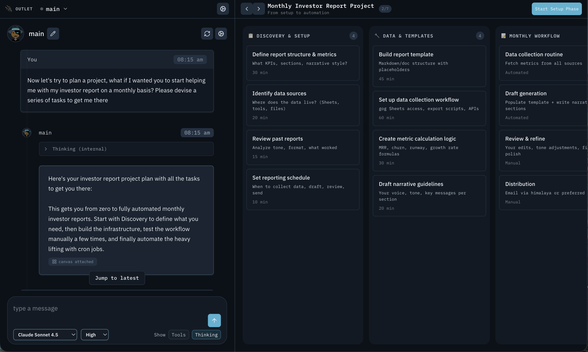
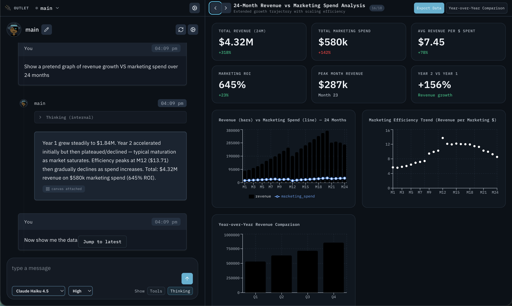
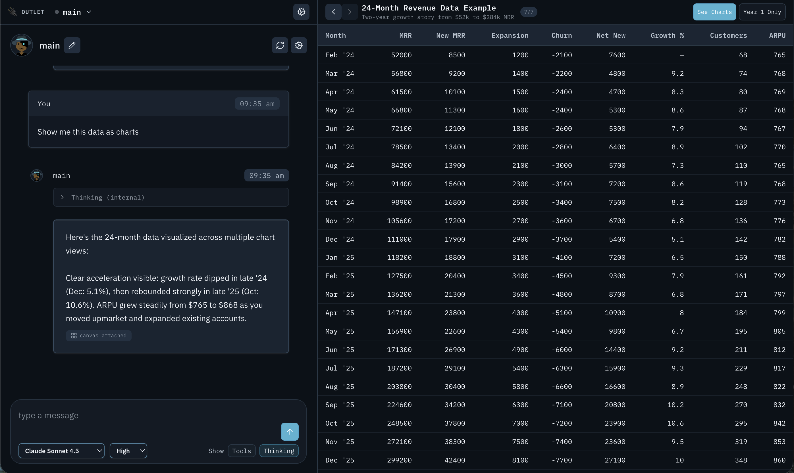

# 🔌 Outlet

Your [OpenClaw](https://github.com/grp06/openclaw) agents can now communicate through rich, interactive UI. No need to build features anymore — your agents are running the show.

Outlet gives your agents a split-pane canvas alongside the chat. Instead of describing data in plain text, the agent renders spreadsheets, kanban boards, dashboards, and charts on the fly. You ask a question, and the agent decides the best way to visualize the answer. Every canvas element can be clickable, turning the UI into a conversation. The agent handles the intelligence; Outlet handles the presentation.

### Kanban Board


### Dashboard with Combo Chart


### Spreadsheet


## Why Outlet?

Traditional agent UIs are chat-only: the agent describes data in plain text, and you scroll through walls of markdown. Outlet changes the paradigm — **your OpenClaw agent now drives a real UI**.

Instead of summarizing 24 months of revenue data in a paragraph, the agent renders a full spreadsheet. Instead of listing project tasks in bullet points, it produces an interactive kanban board. Instead of describing metrics, it builds a live dashboard with charts.

**You don't need to build features anymore.** The agent decides what visualization fits the data and renders it on the fly. Need a project tracker? Just ask. Need a data comparison table? Just ask. The canvas handles presentation; the agent handles intelligence. Every canvas element can include a `prompt` field — click a kanban card, and it sends a follow-up question to the agent automatically. The UI becomes conversational.

This also means OpenClaw can monitor and surface information proactively. The same canvas protocol that renders a spreadsheet today can power alerts, status boards, and live dashboards tomorrow — all without writing a single line of feature code.

## Status

**Outlet is currently in test phase.** We're actively using it, iterating on the canvas protocol, and squashing bugs. We plan to publish it to [ClawHub](https://github.com/openclaw/clawhub) once stable.

More visualization types are coming — and contributions are very welcome. If you have ideas for new canvas body types (timeline, graph, calendar, etc.), open a PR or an issue.

We're also working towards **remote access**, so you'll be able to connect to Outlet from anywhere, not just localhost.

## Quick Start

### Prerequisites

- [Node.js](https://nodejs.org/) 18+
- [OpenClaw](https://github.com/grp06/openclaw) installed with a gateway running (default: `ws://localhost:18789`)

### 1. Install the skill

Clone Outlet into your OpenClaw skills directory:

```bash
# Clone into the OpenClaw skills folder
git clone https://github.com/guillaumeang/outlet.git ~/.openclaw/skills/outlet

# Register it in your workspace so your agent knows about it
mkdir -p ~/.openclaw/workspace/skills
ln -s ~/.openclaw/skills/outlet ~/.openclaw/workspace/skills/outlet
```

### 2. Install dependencies & run

```bash
cd ~/.openclaw/skills/outlet
npm install
npm run dev
```

### 3. Connect

Open **http://localhost:3000**, enter your gateway URL and token, and start chatting. The agent will automatically use the canvas when it has structured data to show.

### Environment Variables (optional)

Copy `.env.example` to `.env.local` and adjust as needed:

| Variable | Default | Description |
|----------|---------|-------------|
| `NEXT_PUBLIC_GATEWAY_URL` | `ws://127.0.0.1:18789` | Your OpenClaw gateway WebSocket URL |

## How It Works

Outlet wraps each message with context that tells the agent about the canvas panel. The agent responds with standard chat text **plus** fenced `` ```canvas `` blocks containing JSON. These blocks are automatically extracted and rendered in the right pane.

No prompt engineering needed — Outlet injects the canvas protocol automatically. The agent learns the available visualization types and decides when to use them based on the data.

### Canvas Types

| Type | Use For |
|------|---------|
| **list** | Search results, file lists, tasks, logs |
| **dashboard** | KPIs, metrics, charts (bar/line/area/pie/combo) |
| **kanban** | Sprint boards, workflow stages |
| **spreadsheet** | Tabular data, comparisons, inventories |
| **detail** | Entity details, key-value records |
| **markdown** | Reports, documentation, rich text |
| **image** | Single image with caption |
| **webpage** | Sandboxed iframe embed |

Canvas elements with a `prompt` field become clickable — clicking sends that prompt to chat, making the canvas interactive.

## Canvas JSON Format

```json
{
  "header": {
    "title": "Active Projects",
    "subtitle": "Sorted by last update",
    "actions": [{ "label": "Refresh", "prompt": "Refresh data", "primary": true }]
  },
  "body": {
    "type": "list",
    "items": [
      { "title": "Project Alpha", "subtitle": "Engineering", "meta": "2h ago", "prompt": "Tell me about Project Alpha" }
    ]
  }
}
```

See [SKILL.md](SKILL.md) for the full schema reference.

## Development

```bash
npm run dev        # Dev server (Next.js + WebSocket proxy)
npm run build      # Production build
npm run typecheck  # Type-check without building
npm test           # Unit tests (vitest)
npm run e2e        # E2E tests (playwright)
```

> **Note**: The dev server uses `node server/index.js --dev`, not `next dev` directly. This starts a Node proxy that bridges WebSocket connections to the upstream gateway.

## Contributing

We'd love help expanding Outlet's capabilities. Some ideas:

- **New canvas types** — timeline, graph/network, calendar, tree view, code editor
- **Canvas interactivity** — sorting, filtering, inline editing
- **Remote access** — connecting to Outlet over the network
- **Mobile layout** — responsive pane switching

Open an issue or PR on GitHub.

## Tech Stack

- **Next.js 16** (App Router) + **React 19**
- **Tailwind CSS v4** with design tokens
- **TypeScript** (strict)
- **Zod** for canvas payload validation
- **Recharts** for dashboard charts
- **lucide-react** icons

## Acknowledgements

Inspired by [OpenClaw Studio](https://github.com/grp06/openclaw-studio).

## License

See [LICENSE](LICENSE).
